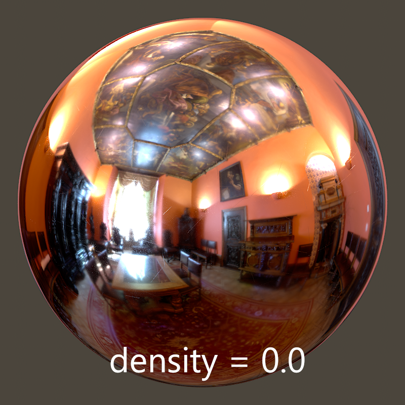

# Scratch
An OSL shader that generates texture to make swirly micro scratch look by controlling the anisotropy and roughness.

It works well with both metal:

and dielectric:

The original idea is from Hang Li(悬挂鲤) and Ben Paschke. Here I implemented it using OSL and exposured some arts friendly parameters.

# Parameters

### density
Controls the heaviness of the scratches.

More scratches takes longer to generate.

### roughness default/min/max
*default* values set the roughness of areas that isn't scrached.

*min/max* controls the range of roughness randomness.

Bigger roughtness makes the swirl longer along it's direction.

### anisotropy default/min/max
Similiar to roughness default/min/max, but namely controls the anisotropy.

Bigger anisotropy enlarge the swirl radius.

### offset
Rotation offset.

> ##### 💡 Tips
> Tweak this parameter to achieve some intersting effect, like radiant or spiral scraches!

### width
Width of the scratches, in UV space.

> ##### 💡 Tips
> 0.001 is a good value to start with.

# Output
 - R: Should be connected to *roughness*.
 - G: Should be connected to *rotation* of anisotropy. With arnold you should add a aiNegate and set the offset to 0.25.
 - B: Should be connected to *anisotropy*.

# Usage

Take a look at the examples under "example_scenes/". For now there are only mtoa and Clarisse scenes shipped. But anyone is welcome to contribute any DCC oriented examples.

For clarisse:

For maya:

(Of course, again, the compatibility is not limited to the DCCs listed above.)

Note that the definition of "Anisotropic Rotation" is slightly different between Clarisse and Arnold. That's the reason that in maya we need some conversion when handling the rotation attribute.

